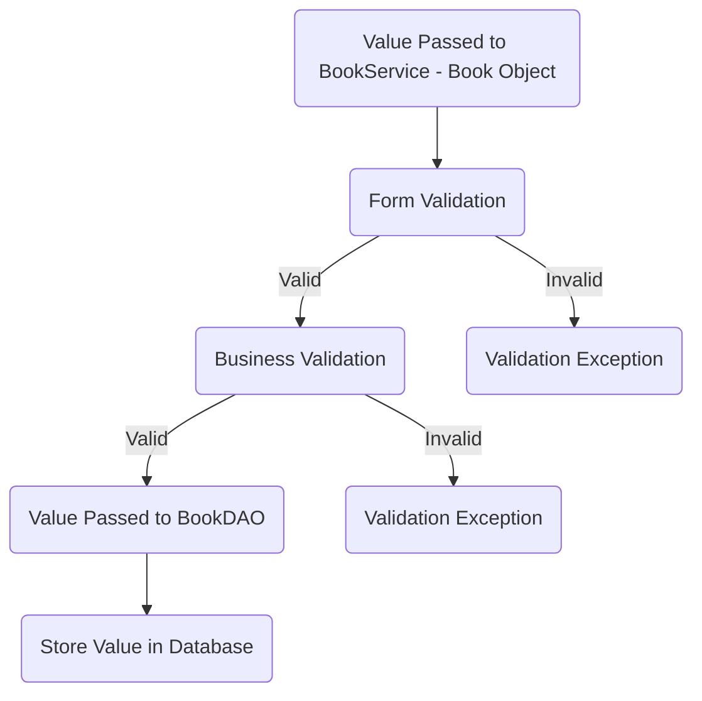
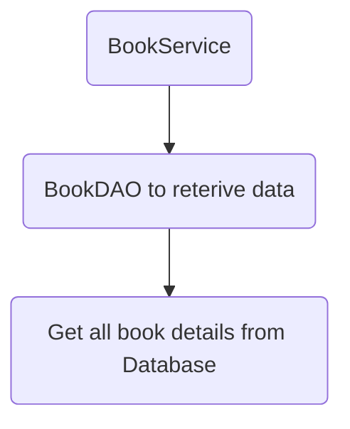
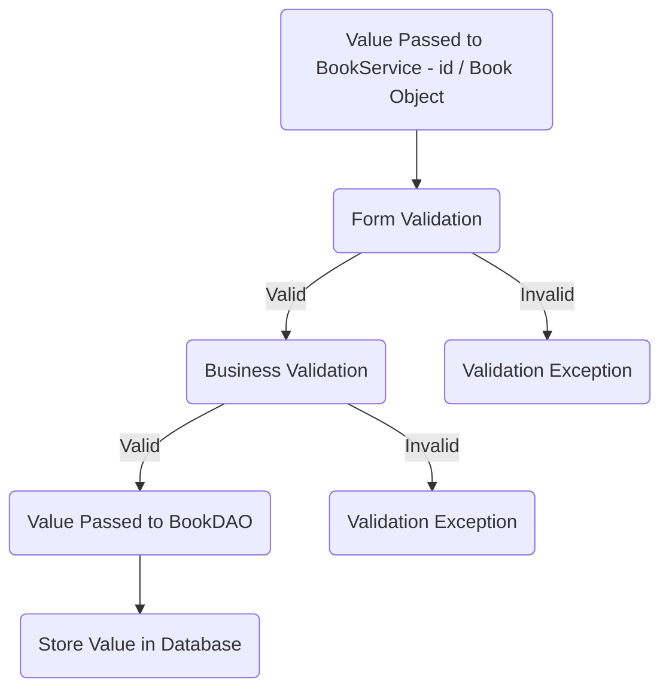
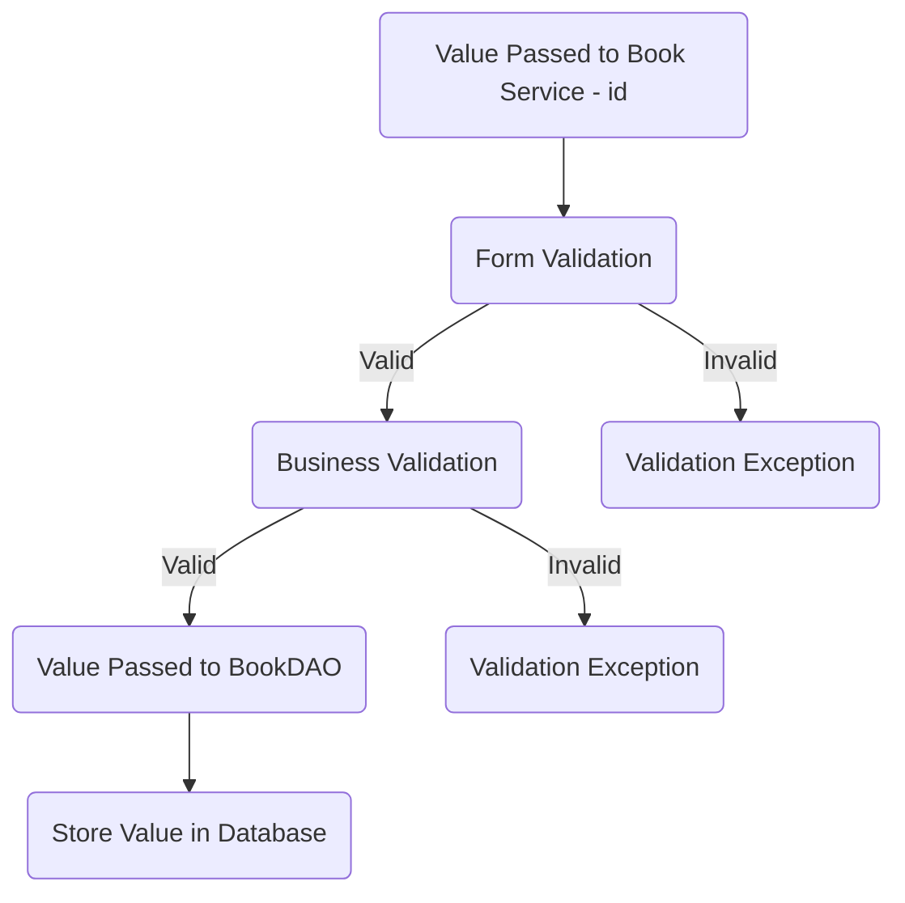

# Techno Library

## Database Design 

- [ ] Create an ER diagram of the database- ![\] ](https://iili.io/HtMjxne.png)
- [ ] Write Create table scripts [script](src/main/resources/db/migration/V1__create_users.sql)

## Project Setup

- [ ] Create a new Java project
- [ ] Set up a MySQL database
- [ ] Add necessary libraries
	- [ ] JDBC, 
	- [ ] MySQL Connector, 
	- [ ] JUnit, 
	- [ ] Dotenv

## Module: Books

### Feature: Add new book

>User can add new book.

#### Pre-requisites :
- [ ] publisher table
- [ ] publisher model
- [ ] publisher DAO(create)
- [ ] publisher service( create )
- [ ] Category table
- [ ] Category model
- [ ] Category DAO(create)
- [ ] Category service( create )
- [ ] book table
- [ ] book model
- [ ] book DAO ( create )
- [ ] book service ( create )

#### Validations : 
- [ ] Form Validation  
* title ( null, empty, pattern )  
* author ( null, empty, pattern )  
* publisher id ( greater than zero )  
* category id (  greater than zero ) 
* published date ( null, empty, format, valid range)  
* price ( greater than zero ) 

 - [ ] Business Validation  
* Publisher id Already exists.
* Category id  Already exists.

#### Messages :  

* Title can not be null or empty.  
* Title does not match the pattern.  
* Author can not be null or empty.  
* Author does not match the pattern.  
* publisher id can not be less than zero.
* category id can not be less than zero.
* published date can not be null or empty.  
* published date does not match the pattern.  
* published date can not be in future. 
* price can not be less than zero.
* Publisher doesn't exists.
* category doesn't exists.

 #### Flow :  
 

### Feature: List all books

>User can find all books.

#### Pre-requisites:  
- [ ] book table
- [ ] book DAO ( find all, find all by id, find all by author )  
- [ ] book service ( find all,  find all by id, find all by author )

 #### Flow:  
 

### Feature: Update book details

>User can change book details.

#### Pre-requisites:  
- [ ] Complete Feature - Create Book
- [ ] book DAO ( update )  
- [ ] book service ( update )

#### Validations:
 - [ ] Form Validation  
	* title ( null, empty, pattern )  
	* author ( null, empty, pattern )  
	* publisher id ( greater than zero )  
	* category id (  greater than zero )  
	* published date ( null, empty, pattern, valid range)  
	* price ( greater than zero ) 
 - [ ] Business Validation  
	* Publisher id Already exists.

#### Messages:

* Title can not be null or empty.  
* Title does not match the pattern.  
* Author can not be null or empty.  
* Author does not match the pattern.  
* publisher id can not be less than zero.
* category id can not be less than zero.
* published date can not be null or empty.  
* published date does not match the pattern.  
* published date can not be in future. 
* price can not be less than zero.
* Publisher doesn't exists.
* category doesn't exists.

 #### Flow:  
 

### Feature: Delete book 

>User can delete book details.

#### Pre-requisites:
- [ ] Complete Feature - Create Book
- [ ] book DAO ( delete )  
- [ ] book service ( delete )

#### Validations: 
- [ ] Form Validation  
	* id (  greater than zero ) 
 - [ ] Business Validation  
	* book id Already exists.

#### Messages: 
  
* publisher id can not be less than zero.
* Book id  Not exists

 #### Flow:  
 

### Feature: List all books by its category

>User can find all books by its category.

#### Pre-requisites:  
- [ ] book table
- [ ] book DAO ( find all by category id )  
- [ ] book service ( find all by category id )

#### Validations: 
- [ ] Form Validation  
	* id ( greater than zero ) 
- [ ] Business Validation  
	* category id Already exists.

#### Messages:  
  
* category id can not be less than zero.
* category id  Not exists

 #### Flow:  
 

### Feature: List all books by publisher id

>User can find all books by publisher.

#### Pre-requisites:  
- [ ] book table
- [ ] book DAO ( find all by publisher id )  
- [ ] book service ( find all by publisher id )

#### Validations:
 - [ ] Form Validation  
	* id ( greater than zero ) 

- [ ] Business Validation  
	* publisher id Not exists.

#### Messages: 
  
* publisher id can not be less than zero.
* publisher id  Not exists

 #### Flow:  
 

